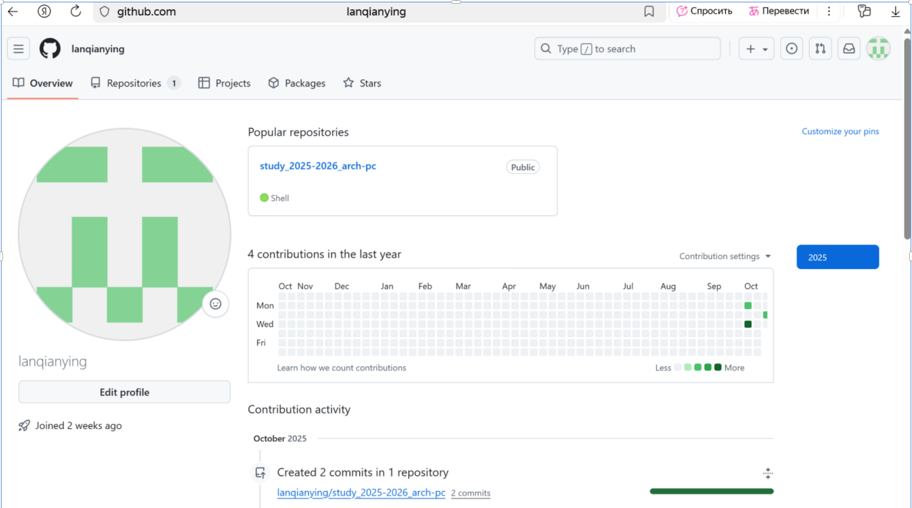
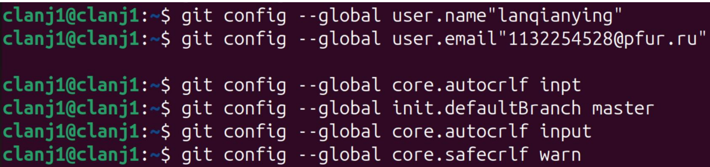
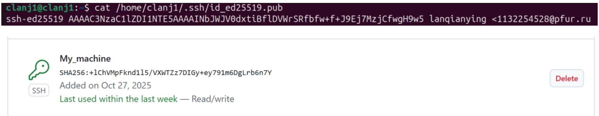
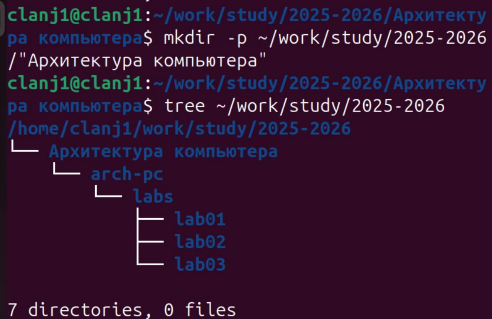
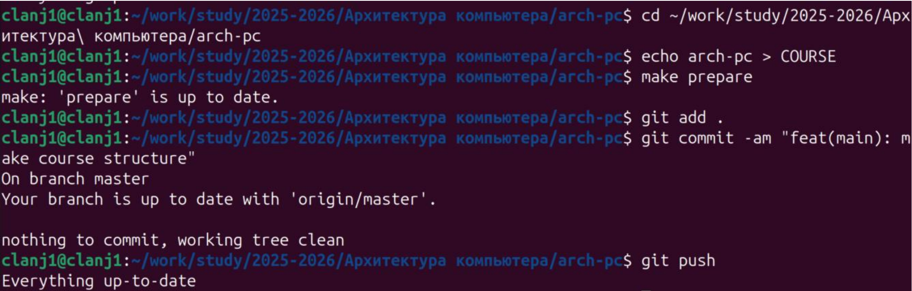
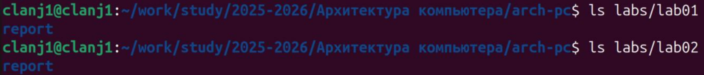
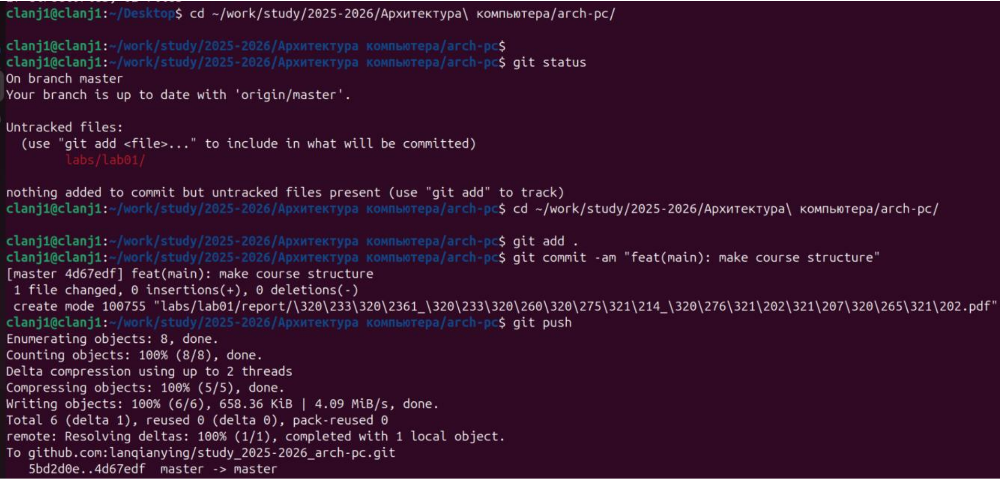
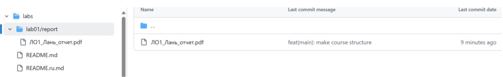
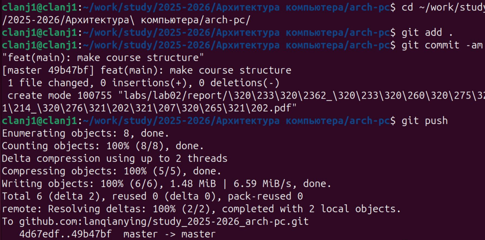

---
# author:
#  name: Лань Цяньин
#  group: НПИбд-03-25
#  student-id: 1132254528

## Title "Лабораторная работа №2. Работа с системой контроля версий Git"
##subtitle: "Отчёт по лабораторной работе №2"
license: "CC BY"

---

## 1. Цель работы  

Целью данной лабораторной работы является изучение идеологии и методов использования средств контроля версий, а также приобретение практических навыков работы с системой контроля версий Git.

## 2. Описание процесса выполнения работы и полученных результатов  

---

### 2.1. Регистрация на GitHub и создание репозитория  

Главная страница профиля на GitHub после регистрации и создания репозитория

{#fig-001 width=70%}

---

### 2.2. Проверка конфигурации Git

На рисунке показан результат выполнения команды git config --list, отображающий глобальные настройки Git: имя пользователя (user.name), электронную почту (user.email), параметры репозитория и подключённые подмодули. Настройка выполнена корректно.

{#fig-002 width=70%}

---

### 2.3.1 Создание SSH-ключа

На рисунке показан процесс генерации SSH-ключа с помощью 
команды ssh-keygen. Ключ успешно создан и сохранён в каталоге 
~/.ssh

{#fig-003-1 width=70%}

### 2.3.2 Добавление публичного ключа на GitHub

На рисунке показано добавление сгенерированного SSH-ключа в 
учётную запись GitHub. Это позволяет выполнять операции с 
репозиторием по защищённому протоколу SSH.

{#fig-003-2 width=70%}

---

### 2.4.  Структура каталогов курса «Архитектура компьютера»

На рисунке представлена структура рабочего пространства, созданная в соответствии с требованиями методических указаний.Каталог arch-pc содержит служебный файл COURSE и каталог labs с подкаталогами lab01, lab02, lab03.

{#fig-004 width=70%}

---

### 2.5.1 Создание репозитория курса на GitHub

На рисунке показано создание нового репозитория курса «Архитектура компьютера» на GitHub на основе шаблона.Репозиторий был создан с именем study_2025-2026_arch-pc.

{#fig-005-1 width=70%}

### 2.5.2 Клонирование репозитория

Командой git clone репозиторий успешно скачан с GitHub

{#fig-005-2-1-1 width=70%} 
    
Затем репозиторий был успешно клонирован на локальный компьютер командой `git clone`. Процесс клонирования показан на рисунке @fig-005-2-2. 
    
{#fig-005-2-2 width=70%}

---

### 2.6. Настройка каталога курса

На данном этапе был выполнен переход в каталог курса, создание служебного файла COURSE, автоматическая генерация структуры лабораторных работ с помощью make prepare, а также фиксация и отправка изменений в удалённый репозиторий GitHub.

{#fig-006 width=70%}

---

## 3. Задания для самостоятельной работы  

### 3.1 Проверка наличия каталогов `report` в `lab01` и `lab02`  

{#fig-007-1 width=70%}

На рисунке показано, что в каталогах lab01 и lab02 успешно созданы подкаталоги report, предназначенные для размещения отчётов по лабораторным работам.

### 3.2 Копирование отчёта в рабочее пространство.

Файл отчёта был скопирован из Windows-системы через общую папку VB_Share
и перенесён в соответствующий каталог лабораторной работы с помощью команды cp

{#fig-007-2 width=70%}

### 3.3 Проверка структуры каталогов с помощью команды `tree`  

{#fig-007-3 width=70%}

### 3.4 На рисунке показан процесс выполнения команд Git для добавления и отправки файлов на сервер GitHub.

Команды git add ., git commit -am "feat(main): make course structure" и git push подтверждают правильную настройку локального репозитория и успешную синхронизацию с удалённым хранилищем

{#fig-007-4-1 width=70%}

{#fig-007-4-2 width=70%}

Загрузка отчёта лабораторной работы №2 на GitHub была выполнена аналогично лабораторной работе №1 с использованием команд:
git add, git commit, git push.
Файл отчёта Л02_Лань_отчет.pdf был успешно 
добавлен в репозиторий в каталог labs/lab02/report

{#fig-008-1 width=70%}

{#fig-008-2 width=70%}

{#fig-008-3 width=70%}

---

## 3. Выводы  

В ходе выполнения лабораторной работы были изучены основные принципы и практические методы использования системы контроля версий Git. Были приобретены навыки:

- регистрации и работы с репозиторием GitHub; 
- настройки Git и подключения по SSH; 
- создания структуры каталогов курса; 
- добавления, фиксации и отправки изменений в удалённый репозиторий.

Цель лабораторной работы полностью достигнута.
