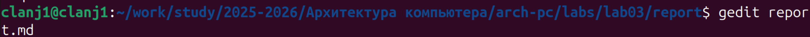

---
# author:
# name: Лань Цяньин
# group: НПИбд-03-25
# student-id: 1132254528

# title: "Отчёт по лабораторной работе №3"
#subtitle: "Работа с репозиторием и системой сборки отчёта"
#license: "CC BY"

---

## Цель работы

Целью работы является освоение процедуры оформления отчетов с помощью легковесного языка разметки Markdown

## Задание

изучить предложенный шаблон отчёта, выполнить все этапы работы, добавить скриншоты выполнения команд и собрать итоговый отчёт в форматах PDF, DOCX и MD с помощью Makefile, после чего загрузить результаты в Github и ТУИС.

## Теоретическое введение

Markdown относится к лёгковесным языкам разметки и позволяет с
помощью простого синтаксиса создавать заголовки, списки, выделения
шрифта, ссылки и фрагменты кода.

Например, в [табл. @tbl-md-syntax] приведены примеры простейших
элементов синтаксиса Markdown.

| Элемент          | Синтаксис                          | Описание                                  |
|------------------|-------------------------------------|-------------------------------------------|
| Заголовок        | `# Заголовок`                      | Заголовок первого уровня                  |
| Полужирный текст | `**text**`                         | Выделение текста полужирным шрифтом       |
| Курсив           | `*text*`                           | Выделение текста курсивом                 |
| Маркированный список | `* item`                      | Создание неупорядоченного списка          |
| Нумерованный список  | `1. item`                     | Создание упорядоченного списка            |
| Ссылка           | `[text](https://example.com)`      | Гиперссылка на веб-страницу или документ  |
| Встроенный код   | `` `code` ``                       | Короткий фрагмент программного кода       |

: Примеры базовых элементов синтаксиса Markdown {#tbl-md-syntax}

## Выполнение лабораторной работы

### 1. Открытие терминала
Открыт терминал для выполнения команд лабораторной работы.

### 2. Переход в каталог курса и обновление репозитория
Выполнен переход в основной каталог курса, после чего репозиторий был обновлён командой `git pull` (рис. @fig-001).

{#fig-001 width=70%}

### 3. Переход в каталог отчёта и запуск компиляции
Выполнен переход в каталог `labs/lab03/report`, содержащий шаблон отчёта, и запущена сборка командой `make` (рис. @fig-002).

{#fig-002 width=70%}

### 4. Сообщения компиляции отчёта (продолжение)
В процессе сборки были выведены сообщения LaTeX и вспомогательных утилит (рис. @fig-003).

{#fig-003 width=70%}

### 5. Успешное завершение компиляции и создание файлов отчёта
После успешного выполнения команды `make` сформированы файлы отчёта `report.pdf` и `report.docx` (рис. @fig-004).

{#fig-004 width=70%}

### 6. Удаление сгенерированных файлов с помощью make clean
Для проверки корректности работы сборки выполнена команда `make clean`, удаляющая ранее созданные файлы (рис. @fig-005).

{#fig-005 width=70%}

### 7. Открытие файла отчёта для редактирования
Для дальнейшего заполнения отчёта файл `report.md` был открыт в редакторе командой `gedit report.md` (рис. @fig-006).

{#fig-006 width=70%}

## Выводы

В ходе работы я изучила основы оформления отчётов в Markdown и научилсяась компилировать их с помощью Makefile/Quarto. Отчёт успешно скомпилирован в форматах md, pdf и docx. Цель работы достигнута.
