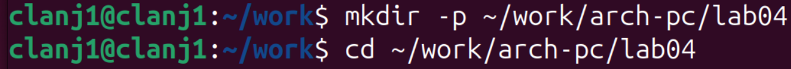
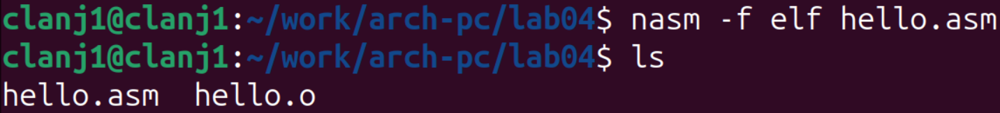
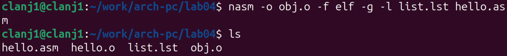
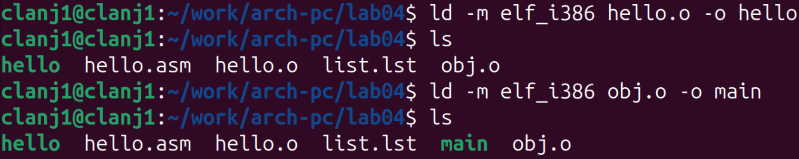
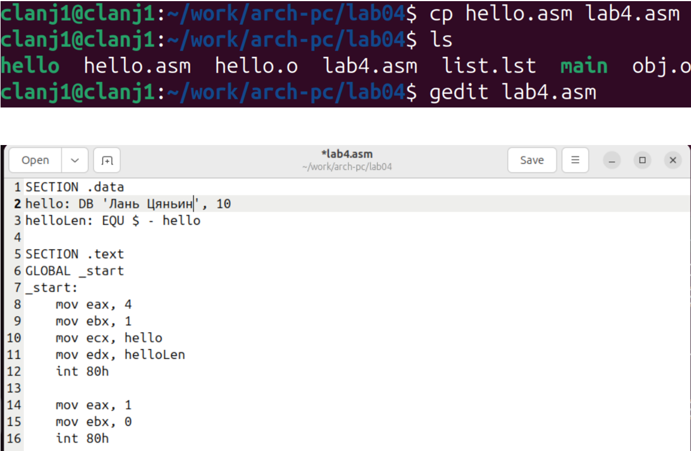
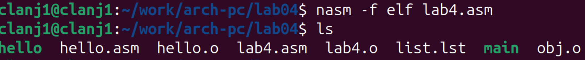
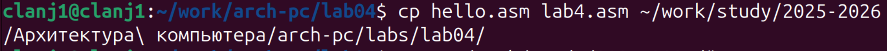
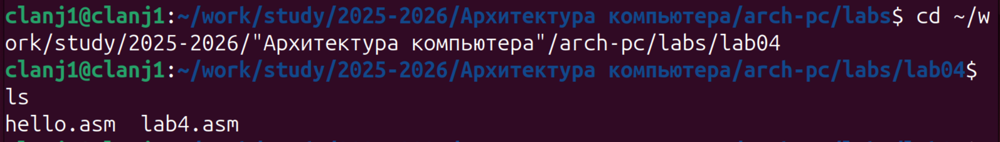

## Author
author:
  - name: "Лань Цяньин"
    affiliation: |
      Группа: НПИбд-03-25
      Студенческий билет: 1132254528
## Title
title: "Отчёт по лабораторной работе №4"
subtitle: "Создание и процесс обработки программ на языке ассемблера NASM"

# 1. Цель работы

Освоить процедуру компиляции, компоновки и запуска программ, написанных на языке ассемблера NASM, а также закрепить на практике процесс создания простых программ и работу с файловой структурой курса.

# 2. Описание результатов выполнения лабораторной работы

## 2.1 Программа Hello world!

Создание рабочего каталога для лабораторной работы №4 (рис. @fig-001). 

{#fig-001 width=70%} 

---

Создание файла hello.asm и открытие его для ввода исходного кода (рис. @fig-002). 

{#fig-002 width=70%} 

Этап демонстрирует корректное создание исходного файла и начало формирования рабочей программы, что обеспечивает возможность перехода к трансляции. 

## 2.2 . Транслятор NASM

Трансляция файла hello.asm и проверка появления объектного модуля hello.o (рис. @fig-003). 

{#fig-003 width=70%} 

Наличие файла hello.o подтверждает корректность трансляции и готовность к дальнейшей компоновке программы. 

## 2.3. Расширенный синтаксис командной строки NASM

Трансляция hello.asm с дополнительными параметрами NASM для получения obj.o и list.lst (рис. @fig-004). 

{#fig-004 width=70%} 

Вывод ls показывает появление obj.o и list.lst, что означает успешное формирование объектного модуля и листинга, позволяющего проверить структуру и адресацию команд.

## 2.4. Компоновщик LD

Компоновка файлов hello.o и obj.o в исполняемые программы hello и main (рис. @fig-005). 

{#fig-005 width=70%} 

Вывод ls фиксирует появление файлов hello и main, что подтверждает успешное создание двух исполняемых программ из разных объектных модулей. 

## 2.5 Запуск исполняемого файла

Запуск исполняемой программы hello после компоновки (рис. @fig-006). 

{#fig-006 width=70%} 

Вывод «Hello World!» подтверждает корректное выполнение программы и правильную работу системы ввода-вывода. 

# 3. Задание для самостоятельной работы

## 3.1 Создание и изменение lab4.asm

Копирование файла hello.asm в lab4.asm и последующее открытие lab4.asm в редакторе для просмотра и редактирования (рис. @fig-007). 

{#fig-007 width=70%} 

Вывод ls подтверждает успешное создание lab4.asm, а отображение исходного кода в редакторе показывает, что файл корректно скопирован и готов для дальнейших изменений в рамках задания. 

## 3.2 Трансляция и компоновка lab4.asm

Трансляция файла lab4.asm с помощью команды nasm -f elf (рис. @fig-008). 

{#fig-008 width=70%} 

Вывод ls показывает появление файла lab4.o, что подтверждает успешную трансляцию lab4.asm и готовность файла к этапу компоновки. 

--

Компоновка объектного файла lab4.o в исполняемую программу lab4 и последующий запуск для проверки вывода (рис. @fig-009). 

{#fig-009 width=70%} 

Вывод «Лань Цяньин» подтверждает 

## 3.3 Копирование файлов в каталог курса и загрузка на GitHub

Копирование файлов hello.asm и lab4.asm в итоговый каталог лабораторной работы курса (рис. @fig-010). 

{#fig-010 width=70%} 

Проверка содержимого итогового каталога лабораторной работы после копирования файлов (рис. @fig-011). 

{#fig-011 width=70%} 

Вывод ls показывает наличие hello.asm и lab4.asm

Отправка файлов лабораторной работы в репозиторий GitHub (рис. @fig-012). 

{#fig-012 width=70%} 

Вывод git показывает успешное создание коммита и сообщение «master -> master», что подтверждает корректную отправку файлов в GitHub. 

# 4. Выводы

В ходе лабораторной работы были освоены основные этапы создания программ на языке ассемблера NASM: трансляция, компоновка и запуск.
Были получены практические навыки работы с утилитами nasm и ld, а также выполнена модификация программы и размещение файлов в репозитории GitHub.
