# 1. Цель работы

Приобретение практических навыков работы в Midnight Commander. Освоение инструкций
языка ассемблера mov и int.

# 2. Порядок выполнения лабораторной работы

## 2.1. Запуск Midnight Commander и переход в рабочий каталог

Запуск Midnight Commander командой `mc` и переход в каталог `~/work/arch-pc` с помощью клавиш ↑/↓ и Enter (рис. @fig-001). 

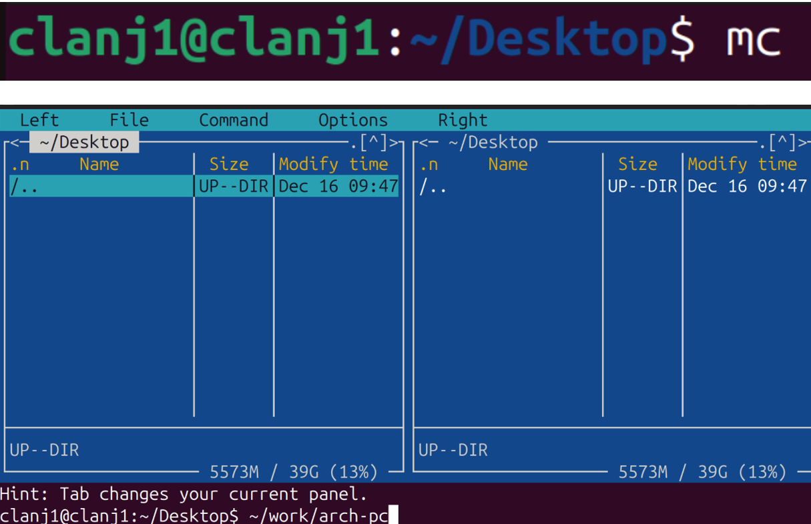{#fig-001 width=80%}

Открытие mc и переход в каталог `~/work/arch-pc` выполнены успешно.

## 2.2. Создание каталога для лабораторной работы и файла программы

С помощью функциональной клавиши **F7** создана папка `lab05` и выполнен переход в созданный каталог; затем с помощью строки ввода и команды `touch` создан файл `lab5-1.asm` (рис. @fig-002).

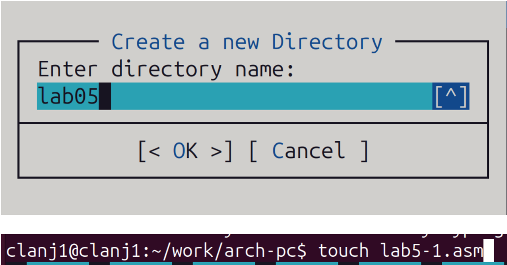{#fig-002 width=80%}

В результате был создан каталог `lab05`, а также файл `lab5-1.asm` для дальнейшего редактирования программы.

## 2.3. Редактирование и ввод первой программы на ассемблере

Открытие файла `lab5-1.asm` клавишей **F4** во встроенном редакторе Midnight Commander и ввод текста программы (рис. @fig-003). 

{#fig-003 width=80%} 

Файл `lab5-1.asm` успешно открыт и отредактирован во встроенном редакторе. 

--

Файл `lab5-1.asm` был открыт для просмотра с помощью клавиши **F3** с целью проверки его содержимого (рис. @fig-004). 

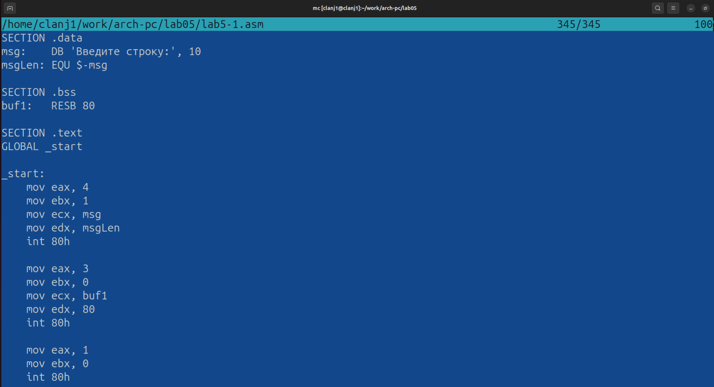{#fig-004 width=80%}  

Код отображается, значит файл создан и заполнен правильно

## 2.4. Трансляция, компоновка и запуск программы lab5-1

Выполнена трансляция программы `lab5-1.asm` в объектный файл, компоновка и запуск полученного исполняемого файла (рис. @fig-005). 

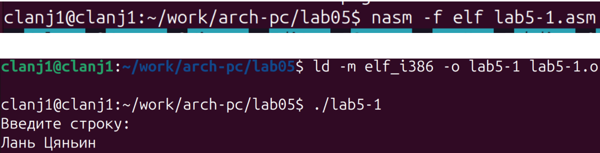{#fig-005 width=80%} 

Программа выводит приглашение и принимает ввод строки, что подтверждает её корректную работу. 

## 2.5. Подключение внешнего файла in_out.asm и создание второй программы

Копирование файла `in_out.asm` в каталог `lab05` (к файлу `lab5-1.asm`) с помощью клавиши **F5** (рис. @fig-006). 

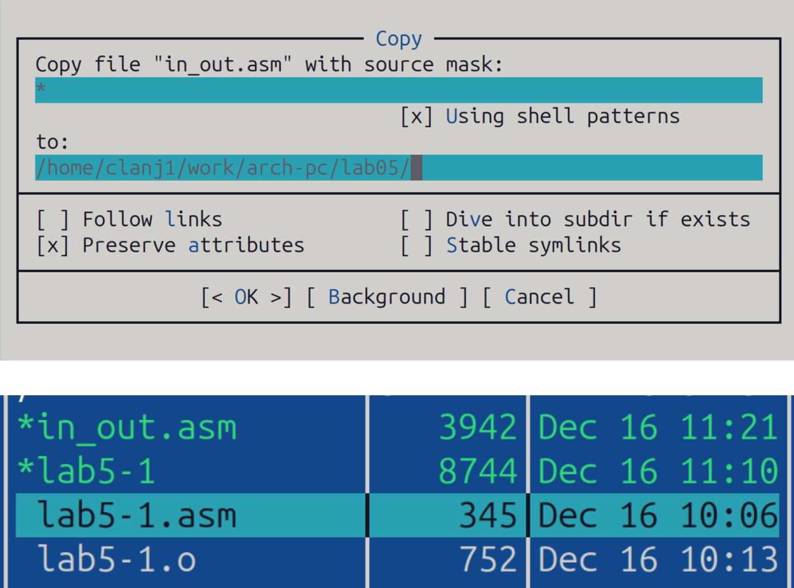{#fig-006 width=80%} 

Окно копирования показывает назначение `.../lab05` и файл `in_out.asm`; после подтверждения он будет лежать рядом с `lab5-1.asm`. 

--

Создание копии файла `lab5-1.asm` с именем `lab5-2.asm` с помощью функциональной клавиши **F6** (рис. @fig-007). 

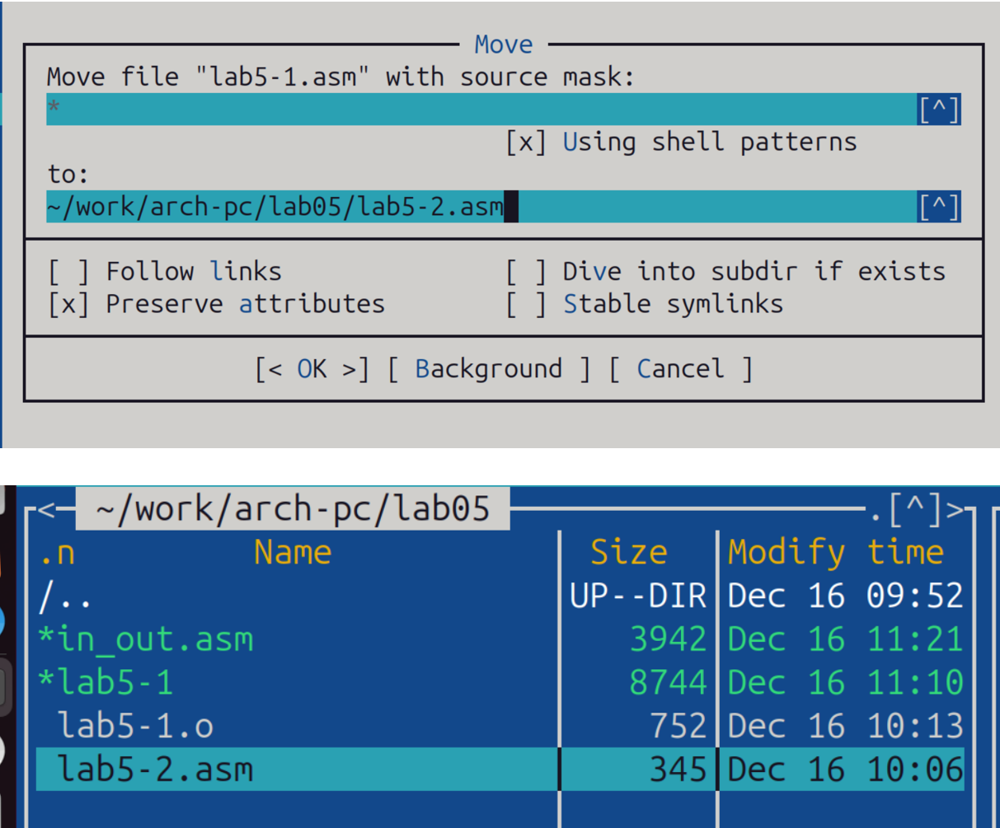{#fig-007 width=80%} 

Появление файла `lab5-2.asm` в каталоге подтверждает успешное создание копии. 

--

Исправление программы в файле `lab5-2.asm`: подключение внешнего файла `in_out.asm` и замена ввода/вывода на подпрограммы `sprintLF`, `sread`, `quit` по листингу 5.2 (рис. @fig-008).

{#fig-008 width=80%}

Окно редактора и наличие директивы `%include` вместе с вызовами `sprintLF/sread` подтверждают, что файл `lab5-2.asm` исправлен по листингу 5.2 и готов к сборке и проверке.

--

Сборка и запуск исправленной программы `lab5-2.asm`: трансляция в объектный файл, компоновка и выполнение(рис. @fig-009).

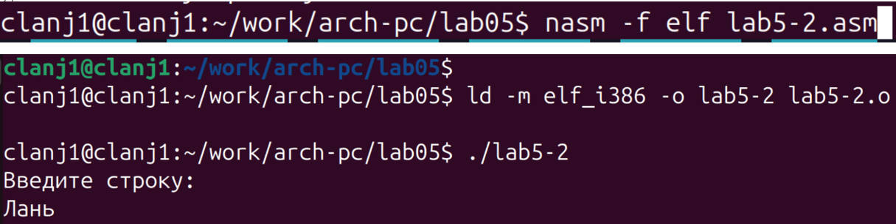{#fig-009 width=80%}

Появление приглашения «Введите строку» и корректный ввод подтверждают, что программа успешно собрана и работает правильно.

## 2.6. Проверка различий между подпрограммами sprintLF и sprint

Замена подпрограммы `sprintLF` на `sprint` в файле `lab5-2.asm`, повторная сборка и запуск программы.(рис. @fig-010).

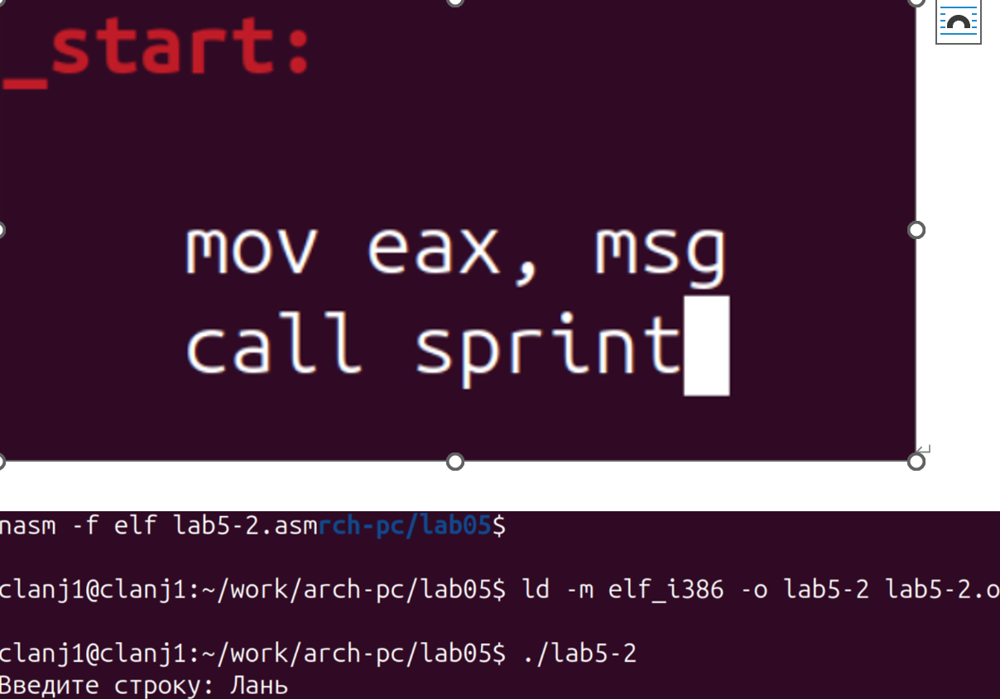{#fig-010 width=80%}

Выводимый текст не переходит автоматически на новую строку, что показывает, что подпрограмма `sprint` не содержит символа перевода строки, тогда как `sprintLF` выводит перевод строки в конце

# 3. Задание для самостоятельной работы

Создание копии файла `lab5-1.asm` с именем `lab5-1-ind.asm`.(рис. @fig-011).

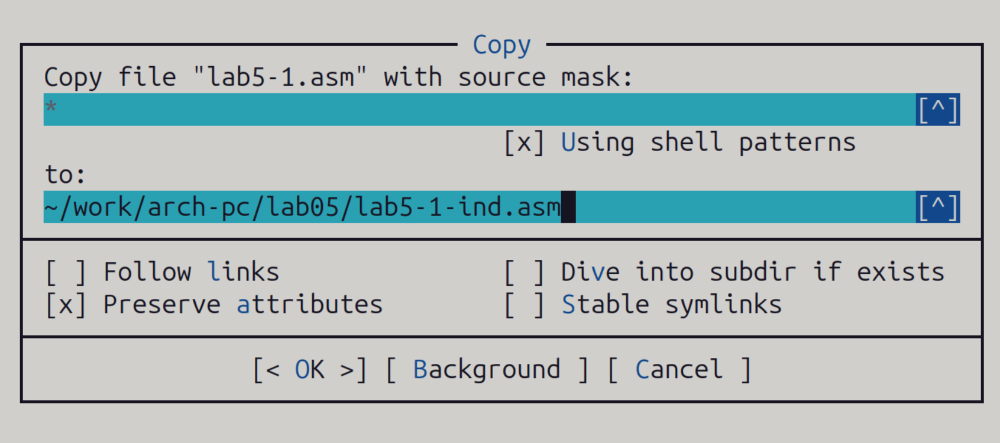{#fig-011 width=80%}

Наличие файла `lab5-1-ind.asm` в каталоге подтверждает успешное создание копии исходного файла.

--

Внесение изменений в программу `lab5-1-ind.asm` без использования внешнего файла `in_out.asm` в соответствии с заданным алгоритмом.

### Листинг программы lab5-1-ind.asm

```asm
SECTION .data
msg:    DB 'Введите строку:', 10
msgLen: EQU $-msg

SECTION .bss
buf1:   RESB 80

SECTION .text
GLOBAL _start

_start:
    mov eax, 4
    mov ebx, 1
    mov ecx, msg
    mov edx, msgLen
    int 80h

    mov eax, 3
    mov ebx, 0
    mov ecx, buf1
    mov edx, 80
    int 80h

    mov edx, eax
    mov eax, 4
    mov ebx, 1
    mov ecx, buf1
    int 80h

    mov eax, 1
    mov ebx, 0
    int 80h

На основе `lab5-1.asm` после чтения строки с клавиатуры добавлены команды вывода введённой строки:
`mov edx, eax`
`mov eax, 4`
`mov ebx, 1`
`mov ecx, buf1`
`int 80h`
после системного вызова `read` добавлен системный вызов `write`, чтобы вывести на экран строку, только что считанную с клавиатуры.


Получение исполняемого файла из `lab5-1-ind.asm` и проверка его работы.(рис. @fig-012).

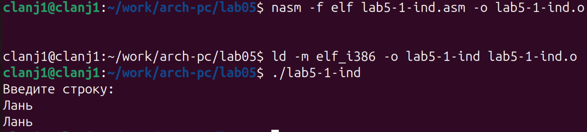{#fig-012 width=80%}

После запуска программа выводит приглашение «Введите строку:», затем принимает введённую строку и выводит её на экран .

--

Создание копии файла `lab5-2.asm` с новым именем `lab5-2-ind.asm`.(рис. @fig-013).

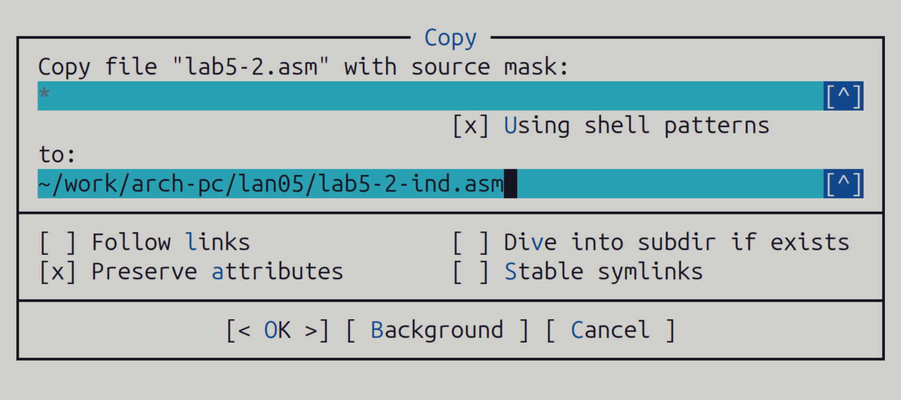{#fig-013 width=80%}

В результате в каталоге создан новый файл `lab5-2-ind.asm`, который является копией исходного файла и может использоваться для дальнейших изменений.

#### Листинг программы lab5-2-ind.asm

```asm
%include 'in_out.asm'

SECTION .data
msg: DB 'Введите строку: ', 0h

SECTION .bss
buf1: RESB 80

SECTION .text
GLOBAL _start

_start:
    mov eax, msg
    call sprint

    mov ecx, buf1
    mov edx, 80
    call sread

    mov eax, buf1
    call sprint

    call quit
    
На основе `lab5-2.asm` после чтения строки с клавиатуры добавлены команды вывода введённой строки:
`mov eax, buf1`
`call sprint`
После чтения строки с клавиатуры с помощью sread содержимое буфера buf1 выводится на экран вызовом подпрограммы sprint.

--

Получение исполняемого файла из `lab5-2-ind.asm` и проверка его работы.(рис. @fig-014).

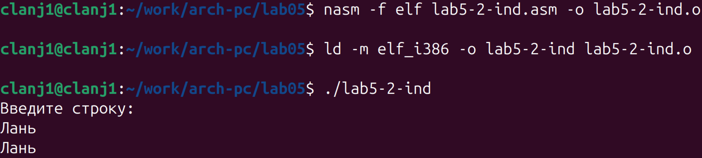{#fig-014 width=80%}

На приглашение «Введите строку:» введена фамилия «Лань», программа корректно вывела введённую строку — алгоритм «приглашение → ввод → вывод» выполнен.

# Выводы

В ходе выполнения лабораторной работы была достигнута поставленная цель.
Были освоены основы работы с файловым менеджером Midnight Commander, а также принципы ввода и вывода данных в программах на языке ассемблера NASM с использованием системных вызовов и подпрограмм.


