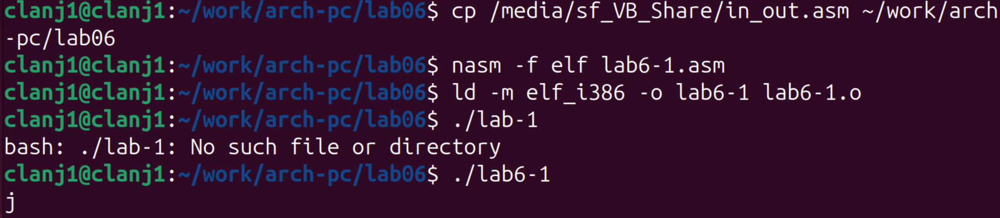
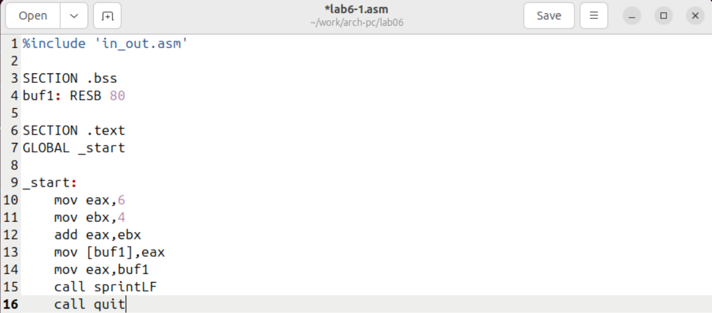
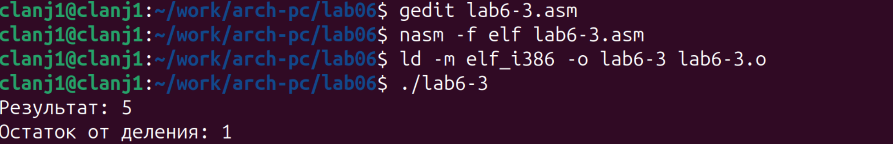
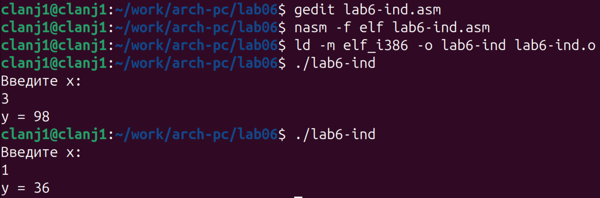

# 1. Цель работы

Освоение арифметических инструкций языка ассемблера NASM

# 2. Порядок выполнения лабораторной работы

## 2.1. Символьные и численные данные в NASM

1.Создан каталог для программ лабораторной работы № 6, выполнен переход в него и создан файл `lab6-1.asm` с помощью команд `mkdir`, `cd` и `touch` (рис. @fig-001).

{#fig-001 width=80%}

В результате был создан каталог `lab06`, в котором подготовлен файл `lab6-1.asm` для дальнейшей работы над программой.

2.В файл `lab6-1.asm` был введён текст программы из листинга 6.1 (рис. @fig-002). 

{#fig-002 width=80%} 

Дан пример работы с регистрами и подпрограммой `sprintLF`: после вычислений значение сохраняется в `buf1`, затем в `eax` загружается адрес `buf1` и выполняется вывод. 

Файл `in_out.asm` был скопирован в каталог `lab06`, после чего выполнены сборка и запуск программы. (рис. @fig-003)

{#fig-003 width=80%} 

В результате на экране был выведен символ `j`, что связано с тем, что в программе выполняется сложение кодов символов `'6'` и `'4'`, а полученное значение соответствует символу `j` в таблице ASCII. 

3.Текст программы `lab6-1.asm` был изменён: вместо символьных констант в регистры записаны числовые значения.  
Строки  
`mov eax, '6'` и `mov ebx, '4'`  
заменены на  
`mov eax, 6` и `mov ebx, 4` в соответствии с заданием.(рис. @fig-004) 

{#fig-004 width=80%} 

Программа была скомпилирована, слинкована и запущена командами `nasm`, `ld` и `./lab6-1` после замены символьных значений на числовые в файле `lab6-1.asm`.  (рис. @fig-005)

{#fig-005 width=80%}  

После запуска программы на экране не появляется видимого вывода, так как функция `sprintLF` интерпретирует значение в регистре `eax` как ASCII-код символа.  
При значении `eax = 10` выводится управляющий символ с кодом 10 (перевод строки), поэтому отображаемый результат визуально отсутствует.  

4.По заданию создан файл `lab6-2.asm` (листинг 6.2): в регистры `eax` и `ebx` записываются символы `'6'` и `'4'`, выполняется сложение `add eax, ebx`, после чего результат выводится подпрограммой `iprintLF`. (рис. @fig-006)

{#fig-006 width=80%}  
  
{#fig-007 width=80%} 

После запуска программа выводит `106`, потому что команда `add` складывает ASCII-коды символов `'6'` и `'4'` (54 + 52 = 106). Подпрограмма `iprintLF` выводит содержимое `eax` как десятичное число, поэтому на экране отображается именно `106`. (рис. @fig-007)

5.В файле `lab6-2.asm` символы заменены на числа, а `iprintLF` — на `iprint`:  
`mov eax, '6'` → `mov eax, 6`, `mov ebx, '4'` → `mov ebx, 4`; вызов `call iprint`.  
(рис. @fig-008)

{#fig-008 width=80%} 

{#fig-009 width=80%} 

При выполнении программы выводится число `10`, так как складываются значения `6` и `4`.  
Функция `iprint` печатает число без перевода строки, тогда как `iprintLF` добавляет перенос строки. (рис. @fig-009)

## 2.2. Выполнение арифметических операций в NASM

6.Создан файл `lab6-3.asm` и введён текст программы из листинга 6.3 для вычисления выражения  (рис. @fig-010)

{#fig-010-width=80%} 

Программа была скомпилирована, слинкована и запущена командами `nasm`, `ld` и `./lab6-3`. (рис. @fig-011)

{#fig-011 width=80%}  

В результате работы программы получено: `Результат: 4`, `Остаток от деления: 1`,  
что соответствует вычислению \(13 / 3 = 4\) и остатку \(1\). 

Для задания 6.3.2 был изменён текст программы для вычисления выражения  
\( f(x) = (4 \cdot 6 + 2)/5 \). В программе изменены константы:  
`mov eax, 4`, `mov ebx, 6`, затем `mul ebx` и `add eax, 2`.  
Перед делением выполняется `xor edx, edx`, после чего деление выполняется на 5: `mov ebx, 5` и `div ebx`.  
После `div` частное находится в `eax`, остаток — в `edx`. (рис. @fig-012)

{#fig-012 width=80%}  

Программа была скомпилирована (nasm), слинкована (ld) и запущена.  
В результате получено: `Результат: 5`, `Остаток от деления: 1`.  
Это соответствует вычислению \( (4\cdot6+2)=26 \), \(26/5 = 5\) и остаток \(1\). (рис. @fig-013)

{#fig-013 width=80%} 

По Листингу 6.4 реализована программа `variant.asm` для вычисления номера варианта по номеру студенческого билета по формуле (S_n mod 20) + 1 (рис. @{fig-014}).

{#fig-014 width=80%}

Программа была скомпилирована с помощью `nasm`, слинкована с помощью `ld` и запущена. В качестве входных данных был введён номер студенческого билета `1132254528`. В результате работы программы на экран был выведен номер варианта: `9`. (рис. @fig-015)

{#fig-015 width=80%} 

### Ответы на вопросы к листингу 6.4

1. Какие строки листинга 6.4 отвечают за вывод на экран сообщения «Ваш вариант:»?
Ответ ：
За вывод сообщения «Ваш вариант:» отвечают строки, в которых в регистр eax загружается адрес строки с текстом сообщения, после чего вызывается подпрограмма вывода sprint (или sprintLF

2. Для чего используются следующие инструкции?
`mov ecx, x`
`mov edx, 80`
`call sread`
Ответ ：
Данные инструкции используются для чтения строки с клавиатуры:
ecx содержит адрес буфера x,
edx задаёт максимальный размер вводимой строки,
подпрограмма sread выполняет ввод данных.

3. Для чего используется инструкция call atoi?
Ответ ：
Инструкция call atoi используется для преобразования введённой строки, содержащей число в текстовом виде, в целочисленное значение.

4. Какие строки листинга 6.4 отвечают за вычисление варианта?
Ответ ：
За вычисление номера варианта отвечают строки, содержащие арифметические операции, включая инструкцию деления div, а также подготовку регистров перед выполнением деления

5. В какой регистр записывается остаток от деления при выполнении инструкции div ebx?
Ответ ：
Остаток от деления при выполнении инструкции div ebx записывается в регистр edx.

6. Для чего используется инструкция inc edx?
Ответ ：
Инструкция inc edx используется для увеличения значения регистра edx на единицу, что позволяет скорректировать номер варианта в соответствии с заданным алгоритмом.

7. Какие строки листинга 6.4 отвечают за вывод на экран результата вычислений?
Ответ ：
За вывод результата вычислений отвечают строки, в которых значение варианта преобразуется в строку и выводится на экран с помощью подпрограммы sprint (или sprintLF).

# 3. Задание для самостоятельной работы

По образцу из Листингов 6.3–6.4 (ввод `x` через `sread` + `atoi`) написана программа `lab6-ind.asm`, которая вычисляет  
вариант 9 из табл. 6.3:  y = 10 + (31x − 5), и выводит результат.  
 
{#fig-016 width=80%} 

{#fig-017 width=80%}

Проверка: при x=3 получено y=98, при x=1 получено y=36 — соответствует формуле варианта 9. 

# Выводы

В ходе выполнения лабораторной работы №6 были изучены арифметические инструкции языка ассемблера NASM и принципы работы с числовыми данными.
Была реализована программа вычисления номера варианта и программа вычисления заданного арифметического выражения.
Цель лабораторной работы достигнута.

