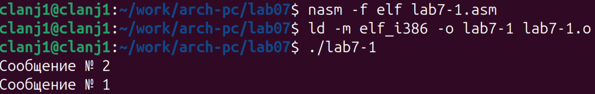
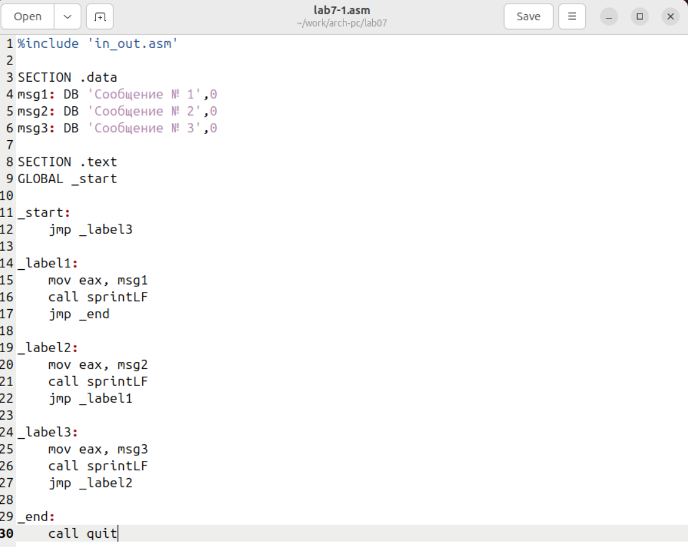
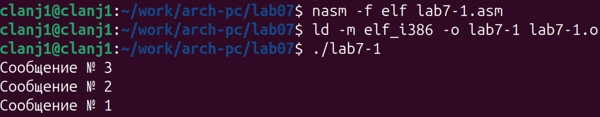
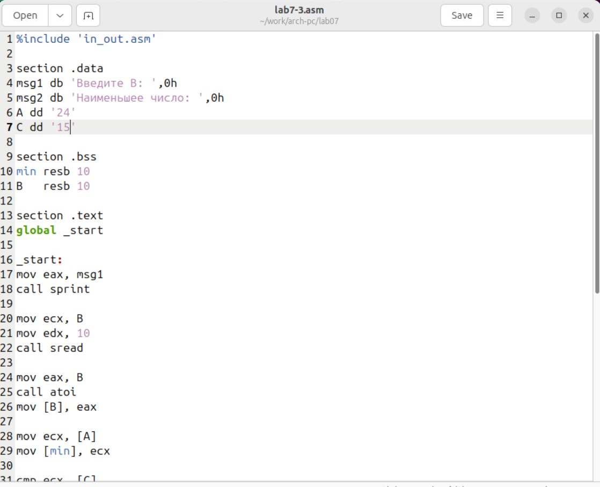
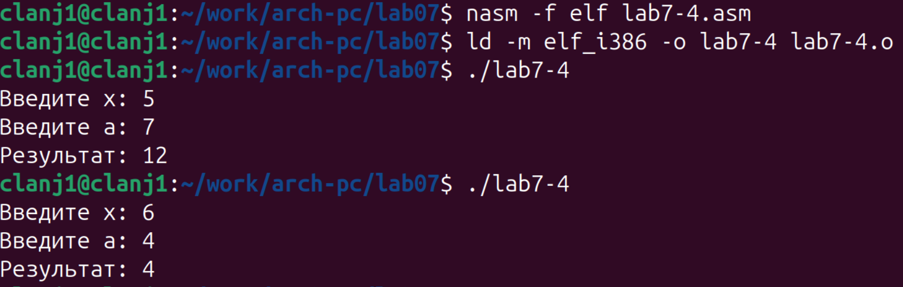

# 1. Цель работы
Изучение команд условного и безусловного переходов. Приобретение навыков написания
программ с использованием переходов. Знакомство с назначением и структурой файла
листинга.

# 2. Порядок выполнения лабораторной работы

## 2.1. Реализация переходов в NASM

**1**. Сначала был создан каталог `~/work/arch-pc/lab07`, после чего выполнен переход в него командой `cd`. (рис. @fig-001).

{#fig-001 width=80%}  

**2**. В ходе лабораторной работы № 7 был создан каталог `lab07` и файл `lab7-1.asm`, в который введён текст программы из листинга 7.1 с использованием инструкции `jmp`. (рис. @fig-002). 

{#fig-002 width=80%}  

Файл `in_out.asm` был скопирован в каталог `lab07`, после чего выполнены компиляция, линковка и запуск программы. (рис. @fig-003).

{#fig-003 width=80%} 

В результате работы программы на экран были выведены строки  
`Сообщение № 2` и `Сообщение № 3`, так как выполнение начинается с перехода `jmp _label2`.  

В ходе лабораторной работы № 7 был изменён текст программы `lab7-1.asm`в соответствии с листингом 7.2 с использованием инструкции `jmp`для изменения порядка выполнения команд.  (рис. @fig-004).

{#fig-004 width=80%} 

После внесения изменений программа была сохранена.  

Программа была модифицирована в соответствии с Листингом 7.2, после чего собрана и запущена.(рис. @fig-005).

{#fig-005 width=80%} 

В результате программа вывела сообщения "Сообщение № 2" и "Сообщение № 1" в указанном порядке, демонстрируя управление порядком выполнения через инструкции `jmp`。 Третье сообщение не было выведено, поскольку управление не возвращалось к соответствующей метке.

Для достижения требуемого порядка вывода (сначала третье сообщение, затем второе, затем первое) программа была модифицирована путем добавления и изменения инструкций `jmp`.(рис. @fig-006).

{#fig-006 width=80%} 

Модифицированный код использует инструкции `jmp` для организации обратного порядка вывода, начиная с метки `_label3`

Модифицированная программа была откомпилирована и запущена, выводя три сообщения в требуемом порядке. (рис. @fig-007)

{#fig-007 width=80%} 

Результат выполнения показал, что программа успешно выводит сообщения в порядке "Сообщение № 3", "Сообщение № 2", "Сообщение № 1", что соответствует поставленной задаче по изменению потока управления с помощью инструкций `jmp`.

**3**. Программа `lab7-2.asm` реализована в точном соответствии с Листингом 7.3 из методического пособия.(рис. @fig-008)

{#fig-008 width=80%} 

Программа демонстрирует сравнение переменных A, C как символов и B — как числа. 

Программа была протестирована с тремя различными значениями B в соответствии с требованием задания. (рис. @fig-009)

{#fig-009 width=80%}  

Результаты тестирования подтверждают корректную работу программы: при B=10 и B=20 выводится C (50), при B=60 — значение B (60).

## 2.2. Изучение структуры файлы листинга

Для программы `lab7-2.asm` был создан файл листинга командой `nasm -f elf -l lab7-2.lst lab7-2.asm(рис. @fig-010)

{#fig-010 width=80%} 

**Объяснение трёх строк листинга :**  

 1.  **00000000 53        push ebx:** Инструкция push ebx сохраняет текущее значение регистра ebx в стеке перед использованием его в подпрограмме.

 2.  **00000003 803800    cmp byte [eax], 0:**Инструкция cmp byte [eax], 0 сравнивает текущий символ строки с нулевым байтом ('\0'), определяя конец строки.

 3.  **00000006 7403      jz finished:** Инструкция jz finished выполняет переход на метку finished, если результат предыдущего сравнения равен нулю.

В файле `lab7-2.asm` в инструкции `mov ecx, [A]` был удалён один операнд, в результате чего она превратилась в неполную инструкцию `mov ecx`(рис. @fig-011)
 
{#fig-011 width=80%} 

При попытке ассемблирования такой программы, транслятор NASM обнаруживает ошибку `invalid combination of opcode and operands` и прекращает процесс(рис. @fig-012)
 
{#fig-012 width=80%} 

**Какие выходные файлы создаются в этом случае?** 

- **Объектный файл (`lab7-2.o`):** **НЕ создаётся**, так как трансляция не прошла успешно.
- **Файл листинга (`lab7-2.lst`):** Создаётся, но его содержимое может быть неполным (до момента ошибки).
 
 
**Что добавляется в листинге?** 

 В файл листинга **не добавляются** специальные отметки об ошибках Сообщения об ошибках выводятся **только на экран (в стандартный поток ошибок)** Листинг содержит только информацию об успешно ассемблированных строках до точки возникновения фатальной ошибки.Таким образом, файл листинга в данном случае является лишь частичным и не содержит указания на синтаксическую ошибку в самом файле.
 
# 3 .Задание для самостоятельной работы
 
**1**.Для выполнения задания №1 (вариант 9) на нахождение наименьшего из трёх целых чисел, программа была модифицирована на основе Листинга 7.3. Вместо поиска максимума теперь выполняется поиск минимума, а также изменены значения переменных A и C на соответствующие варианту (24 и 15)(рис. @fig-013)

{#fig-013 width=80%}  

В программе произведены изменения для поиска минимума: переименованы переменные и сообщения, заменены инструкции условного перехода, установлены значения a=24 и c=15 (значение b вводится с клавиатуры)

Модифицированная программа `lab7-3.asm` была откомпилирована и запущена с входным значением `B=98`, соответствующим варианту 9(рис. @fig-014)

{#fig-014 width=80%}  

Программа вывела результат «Наименьшее число: 24», что соответствует ожидаемому минимальному значению среди a=24, b=98 и c=15

**2**.Для выполнения задания №2 (вариант 9) была написана программа `lab7-4.asm`, вычисляющая значение функции `f(x)` в зависимости от введённых `x` и `a`.(рис. @fig-015)

{#fig-015 width=80%} 

Программа запрашивает у пользователя ввод двух целых чисел: `x` и `a`。 Для этого используются подпрограммы ввода-вывода из файла `in_out.asm`.

Программа `lab7-4.asm` была успешно откомпилирована и запущена для тестирования функции, соответствующей варианту 9.(рис. @fig-016)

{#fig-016 width=80%} 

Программа была протестирована на двух парах значений `(x, a)` из таблицы 7.6. Результаты выполнения соответствуют заданной функции: при `(5, 7)` (где `x ≤ a`) выведено `12` (`7+5`), а при `(6, 4)` (где `x > a`) — `4` (значение `a`).

# Выводы
 
В лабораторной работе были изучены команды условного и безусловного перехода в NASM.
Реализованы программы с ветвлениями, выполнено сравнение числовых данных и проанализирована структура файла листинга.
Цель лабораторной работы достигнута.

