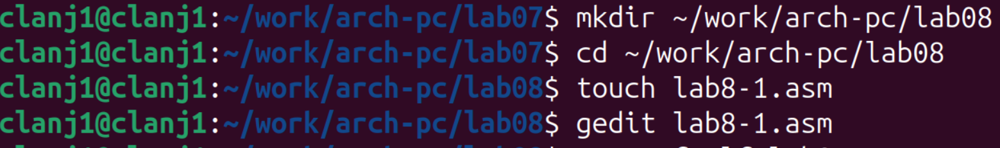
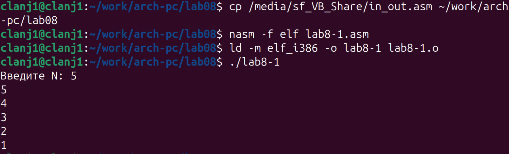
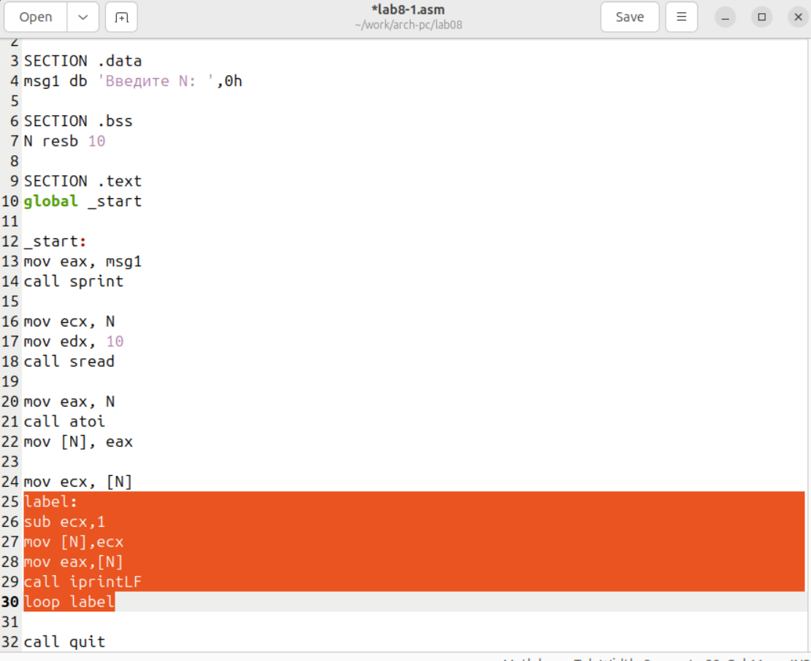
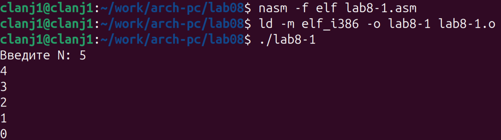
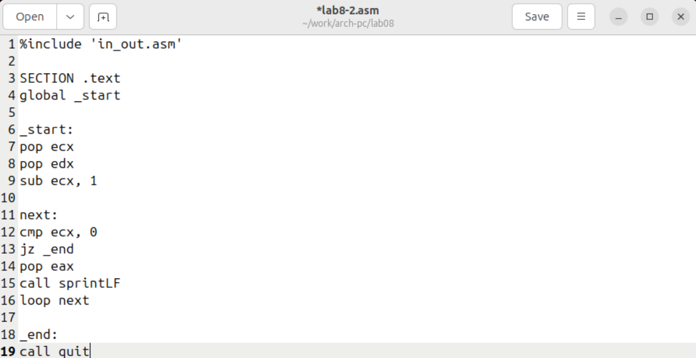
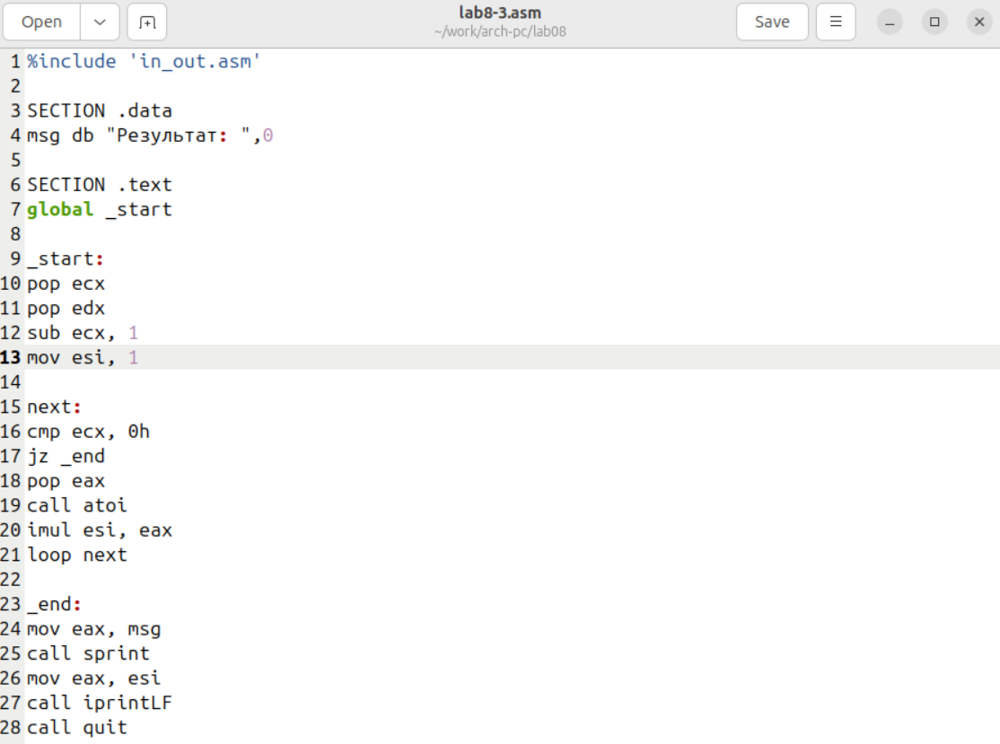
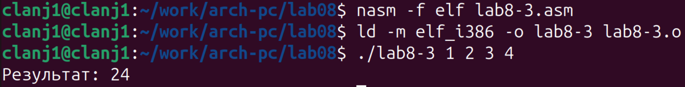
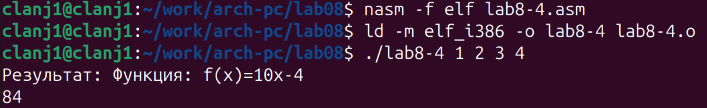

title: "Отчёт по лабораторной работе №8"
subtitle: "Программирование цикла. Обработка аргументов командной строки"

author:
  - name: "Лань Цянын"
    affiliation: |
      Группа: НПИбд-03-25
      Студенческий билет: 1132254528

format:
  pdf:
    toc: false
    lof: false
    lot: false
    number-sections: false
  docx:
    toc: false
    lof: false
    lot: false
    number-sections: false

titlepage: true

# 1. Цель работы

Приобретение навыков написания программ с использованием циклов и обработкой
аргументов командной строки.

# 2. Порядок выполнения лабораторной работы

## 2.1. Реализация циклов в NASM

Для выполнения лабораторной работы №8 создан каталог `Lab08`, внутри него создан файл `lab8-1.asm` в соответствии с инструкциями методического пособия. (рис. @fig-001).

{#fig-001 width=80%}  

Программа `lab8-1.asm` была написана в точном соответствии с Листингом 8.1 из методического пособия.(рис. @fig-002)

{#fig-002 width=80%} 

Программа запрашивает у пользователя число `N`, преобразует его из строки в целое число и затем использует регистр `ecx` как счётчик для цикла, выводя последовательно значения от `N` до `1` с помощью инструкции `loop`.

Программа `lab8-1.asm` была откомпилирована и запущена。 Для её работы в каталог `lab08` был предварительно скопирован необходимый файл `in_out.asm`.(рис. @fig-003)

{#fig-003 width=80%}  

Программа успешно выполняется, используя инструкцию `loop` для организации цикла, который выводит значения от введённого числа 5 до 1.

Исходный код программы `lab8-1.asm` был модифицирован в соответствии с заданием: в тело цикла `label` добавлена инструкция `sub ecx,1`, которая явно уменьшает значение регистра-счётчика на каждой итерации.(рис. @fig-004)

{#fig-004 width=80%}  

Программа, модифицированная добавлением `sub ecx,1` в тело цикла, при выполнении вошла в бесконечный цикл.(рис. @fig-005)

{#fig-005 width=80%}

Это происходит потому, что инструкция `loop` также уменьшает `ecx` на 1, и их совместное действие может привести к тому, что `ecx` никогда не достигнет нуля (например, перескочив с 1 на -1), в результате чего условие завершения цикла не выполняется.

**Ответы на вопросы ：**

1.  **Какие значения принимает регистр ecx в цикле?**  
    Значение регистра ecx уменьшается дважды за одну итерацию цикла: один раз инструкцией sub, и второй раз — инструкцией loop.
В результате выводимая последовательность чисел уменьшается на 2 (например: N−1, N−3, N−5 и т.д.).При нечётном значении N регистр ecx принимает отрицательные значения, что приводит к зацикливанию программы.

2.  **Соответствует ли число проходов цикла значению  N ?**  
   Нет. Поскольку регистр ecx уменьшается два раза за одну итерацию, фактическое число проходов цикла примерно равно N/2 (при чётном N).
При нечётном значении N программа не завершается и переходит в бесконечный цикл.

Программа `lab8-1.asm` была модифицирована с использованием стека для сохранения и восстановления значения счётчика цикла `ecx`, что позволяет корректно работать инструкции `loop` при изменении `ecx` в теле цикла(рис. @fig-006)

{#fig-006 width=80%

Программа, модифицированная с использованием стека для сохранения значения счётчика `ecx`, была успешно откомпилирована и запущена(рис. @fig-007)

{#fig-007 width=80%} 

Использование `push ecx` и `pop ecx` обеспечивает корректную работу инструкции `loop`, гарантируя выполнение цикла ровно `N` раз, что подтверждается выводом последовательных чисел (например, при `N=5` выводится 4, 3, 2, 1, 0)

**Ответ на вопрос задания:**  

**Соответствует ли число проходов цикла значению  N ?** 

Да, полностью соответствует. Использование стека для сохранения состояния регистра `ecx` устраняет проблему двойного уменьшения счётчика, и цикл выполняется ровно `N` раз, как и задумано изначально.

## 2.2. Обработка аргументов командной строки

Программа `lab8-2.asm` для обработки аргументов командной строки была написана в точном соответствии с Листингом 8.2(рис. @fig-008)

{#fig-008 width=80%} 

Программа `lab8-2.asm` была успешно откомпилирована, собрана и протестирована с передачей аргументов командной строки(рис. @fig-009)

{#fig-009 width=80%} 

Программа корректно обработала и вывела все три переданных аргумента, что подтверждает правильность реализации извлечения аргументов из стека и работы циклической обработки

**Ответ на вопрос задания:**  

**Сколько аргументов было обработано программой?**  

Программа обработала **3 аргумента**, что соответствует количеству аргументов, переданных в командной строке (после имени программы).

Программа `lab8-3.asm`, реализующая вычисление суммы числовых аргументов командной строки, была написана на основе Листинга 8.3(рис. @fig-010)

{#fig-010 width=80%}

Программа `lab8-3.asm` была откомпилирована и запущена с передачей числовых аргументов для проверки работы алгоритма суммирования(рис. @fig-011)

{#fig-011 width=80%}  

Программа успешно обработала аргументы `1 2 3 4`.Ожидаемый результат суммирования — `10`. Это подтверждает корректную работу всех этапов: извлечения количества аргументов, их преобразования из строк в числа (`atoi`), накопления суммы в регистре `esi` и вывода итога

Программа `lab8-3.asm` была модифицирована для вычисления **произведения** числовых аргументов командной строки вместо их суммы(рис. @fig-012)

{#fig-012 width=80%}  

Регистр `esi` (в коде `est`) инициализируется значением **`1`** вместо `0`, так как произведение любого числа на 1 равно самому числу.Инструкция сложения `add est, eax` заменена на инструкцию умножения **`imul est, eax`**

Модифицированная программа `lab8-3.asm` была успешно откомпилирована и запущена для проверки вычисления произведения аргументов(рис. @fig-013)

{#fig-013 width=80%}

Программа корректно вычислила и вывела результат `24`, что соответствует произведению чисел 1, 2, 3 и 4.

# 3. Задание для самостоятельной работы

Программа `lab8-4.asm` была написана для вычисления суммы значений функции  f(x) = 10x - 4 (вариант 9) для набора чисел x , переданных в качестве аргументов командной строки(рис. @fig-014)

{#fig-014 width=80%}

Программа `lab8-4.asm` была успешно откомпилирована и протестирована на наборе значений `1 2 3 4`(рис. @fig-015)

{#fig-015 width=80%}

Программа вывела ожидаемый результат: `84`。 Это подтверждает, что она корректно вычисляет значение функции f(x) = 10x - 4  для каждого переданного аргумента x , суммирует эти значения и выводит итог

# 4 Выводы

В ходе лабораторной работы № 8 были изучены инструкции организации циклов в NASM и способы обработки аргументов командной строки. Рассмотрено влияние изменения регистра ecx на корректность работы инструкции loop и показана необходимость использования стека для сохранения счётчика цикла. Получены практические навыки работы с циклами, стеком и аргументами командной строки, что соответствует цели лабораторной работы.

