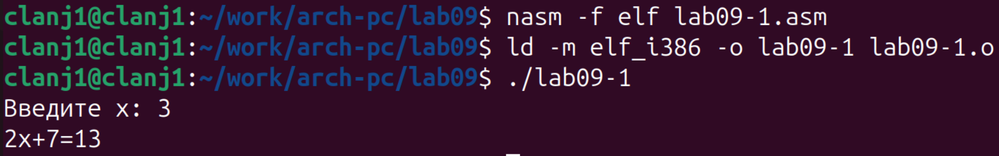
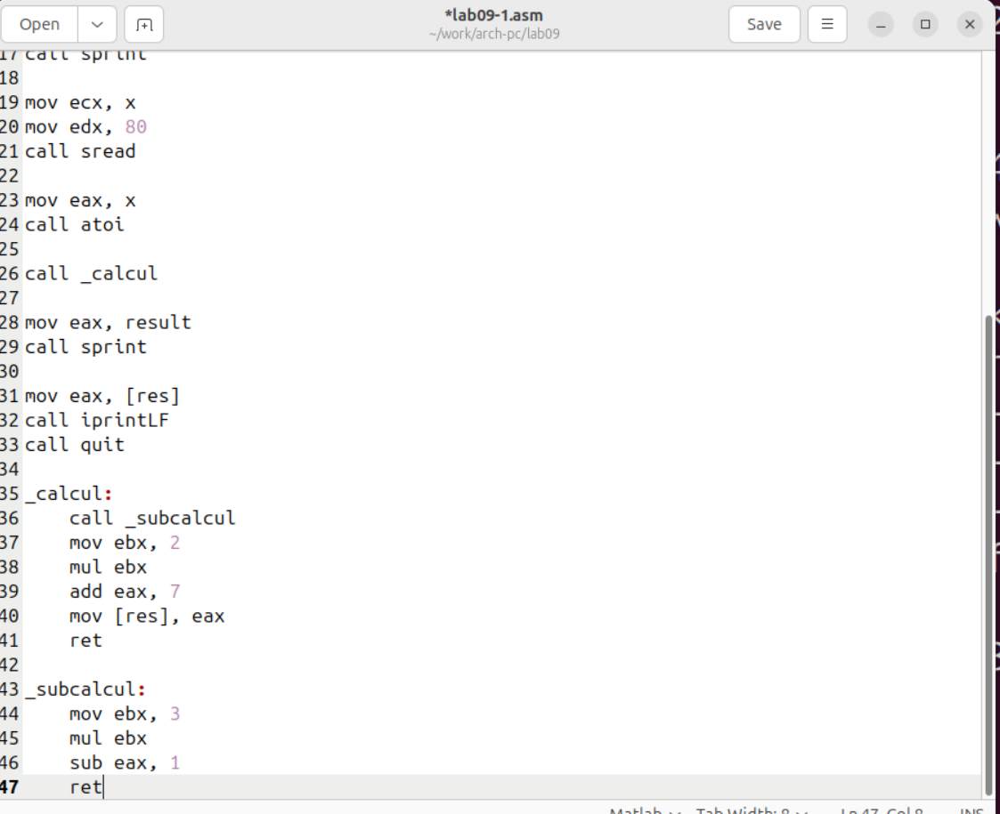
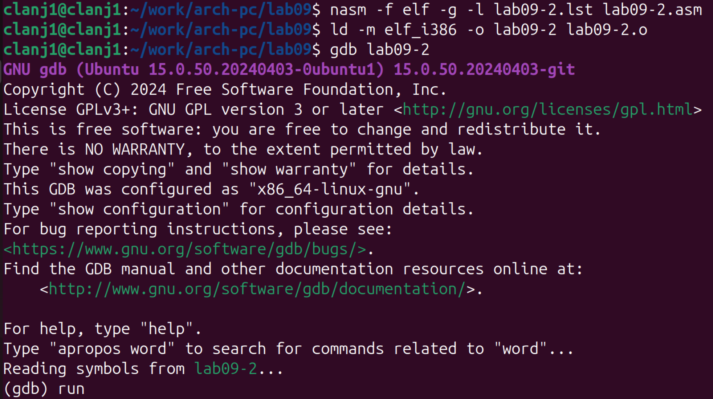
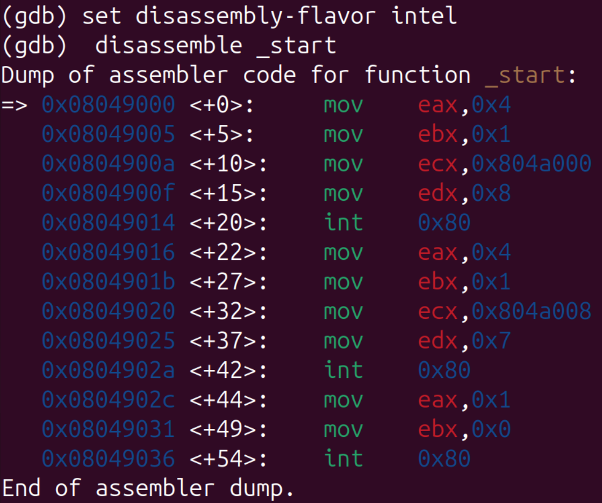
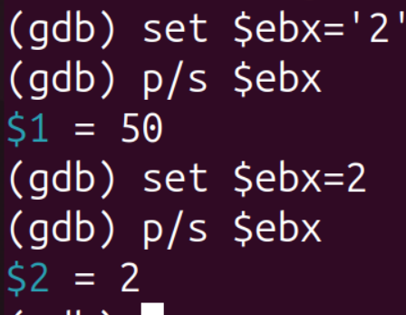
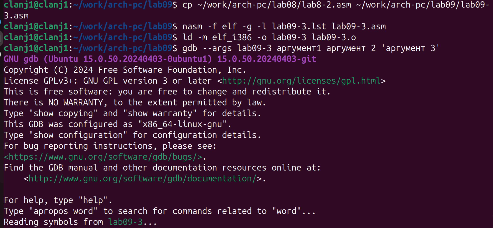
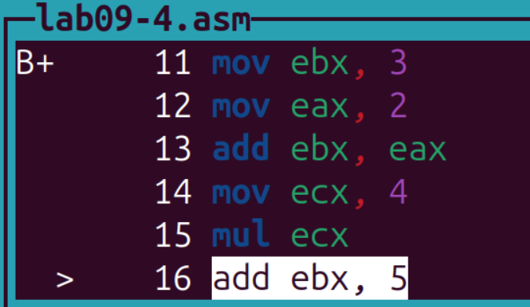
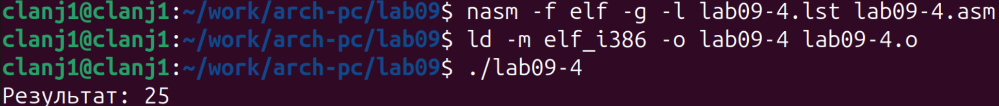

# 1. Цель работы

Приобретение навыков написания программ с использованием подпрограмм. Знакомство
с методами отладки при помощи GDB и его основными возможностями

# 2. Порядок выполнения лабораторной работы

## 2.1. Порядок выполнения лабораторной работы

Для выполнения лабораторной работы №9 создан каталог `lab09`, внутри него создан файл `lab09-1.asm` в соответствии с инструкциями.(рис. @fig-001)

{#fig-001 width=80%}

Выполнены начальные шаги по подготовке окружения для реализации программы с использованием подпрограмм (процедур).

Программа `lab09-1.asm` для вычисления выражения `2x+7` с использованием подпрограммы была написана в соответствии с Листингом 9.1.(рис. @fig-002)

{#fig-002 width=80%}  

Программа `lab09-1.asm` была успешно откомпилирована и запущена, демонстрируя работу с подпрограммой для вычисления выражения `2x+7`.(рис. @fig-003)

{#fig-003 width=80%} 

Программа корректно запросила ввод `x`, вызвала подпрограмму `_calcul`, вычислила результат и вывела его. При вводе `x=3` результат `13` соответствует выражению `2*3+7`, что подтверждает правильность реализации передачи параметров через регистр `eax`, работы подпрограммы и возврата результата.

Программа `lab09-1.asm` была модифицирована для вычисления составной функции f(g(x)) путём добавления вложенной подпрограммы `_subcalcul`(рис. @fig-004)

{#fig-004 width=80%} 

Модифицированная программа `lab09-1.asm` с вложенной подпрограммой была успешно откомпилирована и протестирована(рис. @fig-005)

{#fig-005 width=80%}  

При вводе `x=3` программа вывела результат `23`。 Это соответствует ожидаемому значению составной функции `f(g(x))`, где `g(x)=3x-1`, `f(x)=2x+7`: `g(3)=8`, `f(8)=23`.Результат подтверждает корректную работу механизма вложенных подпрограмм и передачи параметров через регистры

## 2.2. Отладка программам с помощью GDB

Программа `lab09-2.asm` была успешно откомпилирована с ключом `-g` для генерации отладочной информации и сгенерирован исполняемый файл, пригодный для отладки в GDB(рис. @fig-006)

{#fig-006 width=80%} 

Программа была запущена в отладчике GDB с использованием точек останова для демонстрации пошагового контроля выполнения(рис. @fig-007)

{#fig-007 width=80%}

В ходе отладки программы `lab09-2` была выполнена команда `disassemble _start` для просмотра дизассемблированного кода функции `_start` в синтаксисе AT&T (по умолчанию в GDB)(рис. @fig-008)

{#fig-008 width=80%} 

После переключения синтаксиса дизассемблирования на Intel с помощью команды `set disassembly-flavor intel`, код функции `_start` был выведен в соответствующем формате.(рис. @fig-009)

{#fig-009 width=80%}

В режиме псевдографики GDB, активированном командой `layout regs`, интерфейс отладчика разделён на три функциональные области (окна)(рис. @fig-010)

{#fig-010 width=80%} 

### 2.2.1. Добавление точек останова

В графическом режиме GDB (`layout regs`) была установлена вторая точка останова по адресу инструкции `0x8049031` (строка 24 в `lab09-2.asm`)， соответствующей команде `mov ebx, 0x0`(рис. @fig-011)

{#fig-011 width=80%}  

Команда `info breakpoints` подтвердила наличие двух точек:первая на `_start` (строка 11)， вторая — по адресу `0x08049031` (строка 24). Это позволяет детально анализировать выполнение программы от начала до предпоследней инструкции

### 2.2.2. Работа с данными программы в GDB

В ходе пошагового выполнения программы с помощью команды `si 5` были выполнены инструкции(рис. @fig-012)
 
 {#fig-012 width=80%} 
 
  С помощью команды `set {char}msg1='h'` первый символ строки `msg1` был изменён с `'H'` на `'h'`。 Повторная команда `x/1sb &msg1` подтвердила изменение: вывелась строка `"hello, "`(рис. @fig-013)
 
{#fig-013 width=80%}  

На рисунке показано использование команд `set` и `print` в GDB для присвоения регистру `ebx` значения символа и целого числа с последующей проверкой.(рис. @fig-014)

{#fig-014 width=80%}

Результат наглядно демонстрирует разницу: присваивание `$ebx='2'` сохраняет ASCII-код символа (50), а `$ebx=2` — непосредственно числовое значение.

На рисунке показано использование команды `print` в GDB с различными форматами вывода для отображения одного и того же значения регистра `edx`.(рис. @fig-015)

{#fig-015 width=80%}

Команды `p/x`, `p/t` и `p/s` демонстрируют одно и то же значение (8) в шестнадцатеричном (0x8), двоичном (1000) и десятичном (8) представлении соответственно. Это наглядно показывает, как один и тот же числовой тип данных может быть отображён в разных системах счисления.

### 2.2.3. Обработка аргументов командной строки в GDB

На рисунке показан процесс подготовки и загрузки программы `lab09-3` с аргументами командной строки в отладчик GDB.(рис. @fig-016)

{#fig-016 width=80%}

На скриншоте последовательно выполняются команды копирования исходного файла, его компиляции (`nasm`), компоновки (`ld`) и, наконец, загрузки в GDB с использованием ключа `--args` и тремя тестовыми аргументами, включая аргумент в кавычках (`'apryмент 3'`). Успешный вывод информации о версии GDB и сообщения `"Reading symbols from lab09-3..."` 

На рисунке показан процесс установки точки останова и запуска программы в GDB.(рис. @fig-017) 

{#fig-017 width=80%}

После выполнения команд `b _start` и `run` программа останавливается на первой инструкции `pop ecx` (строка 7), что позволяет исследовать начальное состояние стека и регистров.  

На рисунке показана практическая проверка расположения аргументов командной строки в стеке с помощью команд GDB `x/x` и `x/s`.  (рис. @fig-018) 

{#fig-018 width=80%}

Вершина стека (`$esp`) содержит количество аргументов (5). Команды `x/s` показывают сами аргументы, хранящиеся по адресам в стеке. Шаг в 4 байта между элементами обусловлен размером указателя в 32-битной архитектуре.

# 3. Задание для самостоятельной работы

В данном задании требуется откомпилировать, запустить и проанализировать программу `lab09-4.asm`, предназначенную для вычисления выражения (3+2)*4+5, с целью обнаружения возможных ошибок с помощью отладчика GDB. (рис. @fig-019)

{#fig-019 width=80%}  

{#fig-020 width=80%}  

Программа была успешно скомпилирована и собрана с помощью `nasm` и `ld`. При запуске она выводит строку "Результат: 25". Хотя результат совпадает с ожидаемым значением выражения (3+2)*4+5 = 25), согласно условию задания программа содержит логическую ошибку, которую необходимо выявить путём пошагового анализа в GDB. Это требует проверки последовательности инструкций и состояния регистров на каждом этапе вычисления.  (рис. @fig-020)

# 4 вывод

Освоены основы создания подпрограмм на ассемблере и их отладки в GDB, что развивает ключевые практические навыки для программирования низкого уровня.

