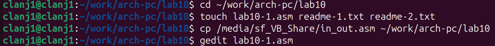
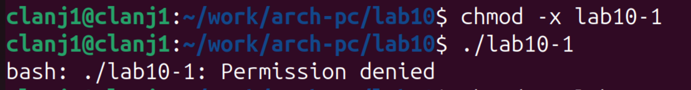
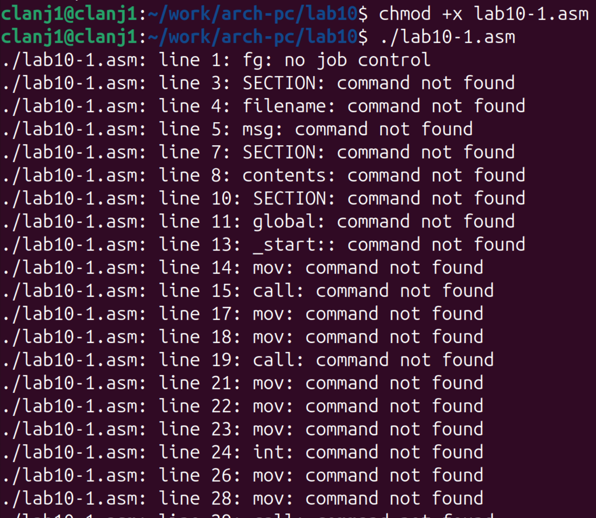
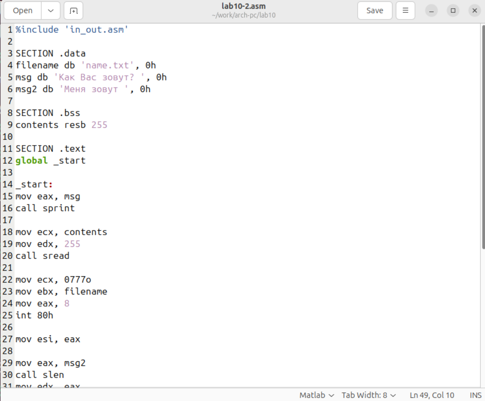
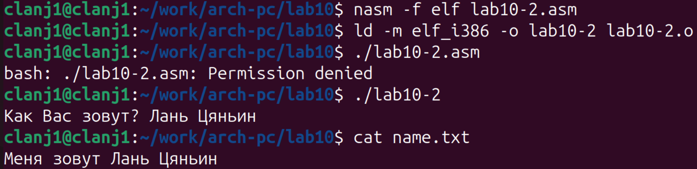

# 1. Цель работы

Приобретение навыков написания программ для работы с файлами

# 2. Порядок выполнения лабораторной работы

На данном этапе выполняется подготовка рабочего окружения для лабораторной работы №10. Последовательно создаются необходимые файлы, копируется библиотечный модуль и открывается редактор для написания исходного кода.(рис. @fig-001)

{#fig-001 width=80%}

На рисунке показан исходный код программы `lab10-1.asm` из листинга 10.1. (рис. @fig-002)

{#fig-002 width=80%}

Программа была успешно скомпилирована и скомпонована. В ходе тестирования через стандартный ввод была передана строка «999999». После выполнения программы созданный файл `readme.txt` был проверен командой `cat`, которая вывела введённую строку. Результат подтверждает корректность реализации файлового вывода в программе(рис. @fig-003)

{#fig-003 width=80%}

На рисунке последовательно показаны ключевые этапы работы с программой `lab10-1.asm`: компиляция, компоновка, запуск и проверка результата. Программа считывает строку и записывает её в указанный файл.  

После выполнения команды `chmod -x lab10-1`, которая отнимает право на выполнение у файла, попытка запуска (`./lab10-1`) завершается ошибкой `Permission denied`.(рис. @fig-004)

{#fig-004 width=80%} 

На рисунке показан результат изменения прав доступа к исполняемому файлу с помощью команды `chmod` и попытка его запуска.  

Команда `chmod +x` добавила файлу права на выполнение, но запустить его не удалось: система попыталась интерпретировать ассемблерный код как команды оболочки, что привело к ошибкам. Это показывает, что для выполнения файл должен содержать машинный код, а не исходный текст. (рис. @fig-005)

{#fig-005 width=80%}

На рисунке показана попытка запуска на выполнение файла с исходным кодом на ассемблере после добавления ему соответствующих прав доступа.

В ходе выполнения задания для моего варианта №9 были установлены права доступа для файлов `readme-1.txt` и `readme-2.txt`.(рис. @fig-006)

{#fig-006 width=80%}

В результате для файла `readme-1.txt` (команда `chmod u=x,g=w,o=w`) установлены права `--x-w--w-`, а для `readme-2.txt` (команда `chmod 135`) — права `--x-wxr-x`. Вывод команды `ls -l` подтверждает точное соответствие между применёнными командами и итоговыми правами,

# 3. Задание для самостоятельной работы

{#fig-007 width=80%}

На рисунке представлен исходный код программы `lab10-2.asm`. (рис. @fig-007)

После сборки исполняемого файла программа была запущена. Она вывела приглашение ввести имя, на что был дан ответ «Лань Цяньин». Затем с помощью команды `cat` было проверено содержимое созданного программой файла `name.txt`. Файл содержал ожидаемую строку «Меня зовут Лань Цяньин», что подтверждает корректную работу всех этапов программы: ввода данных, создания файла и записи в него.(рис. @fig-008)

{#fig-008 width=80%}

Программа `lab10-2.asm` была успешно откомпилирована и запущена.

# 4 вывод

В лабораторной работе научился работать с файлами через системные вызовы NASM. На практике использовал sys_creat для создания файла и sys_write для записи данных, а также команду chmod для управления правами доступа. Результат — программа, которая запрашивает имя и сохраняет его в файл. Работа выполнена.

